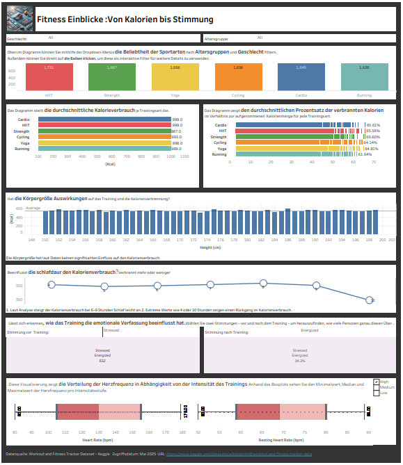

## Fitness Insights – From Calories to Mood

This project analyzes workout and fitness tracker data to explore the relationship between
training intensity, calorie burn, heart rate, sleep duration, and emotional well-being.

The dashboard focuses on how different sports, body metrics, and habits influence
both physical performance and mood.

---

### 📊 Dashboard Preview

---

### 🔍 Key Insights

- Comparison of calorie burn across different sports (HIIT, Strength, Yoga, Cardio, Running)
- Analysis of average calories burned per training type
- Heart rate distribution by workout intensity
- Impact of sleep duration on calorie consumption
- Relationship between training and emotional state (before vs after workout)
- Body height analysis and its influence on training metrics

---

### 🛠 Tools & Technologies

- **Tableau Desktop**
- Fitness & workout tracker dataset

---

### 🌐 Tableau Public Link

🔗 https://public.tableau.com/views/Workout_17451423378670/Sportanalyse

---

### 👩‍💻 Author

**Mahnoosh Shoaibi**

---

> This dashboard is part of my Tableau Portfolio and reflects my growing experience
in data visualization, dashboard design, and analytical storytelling.
