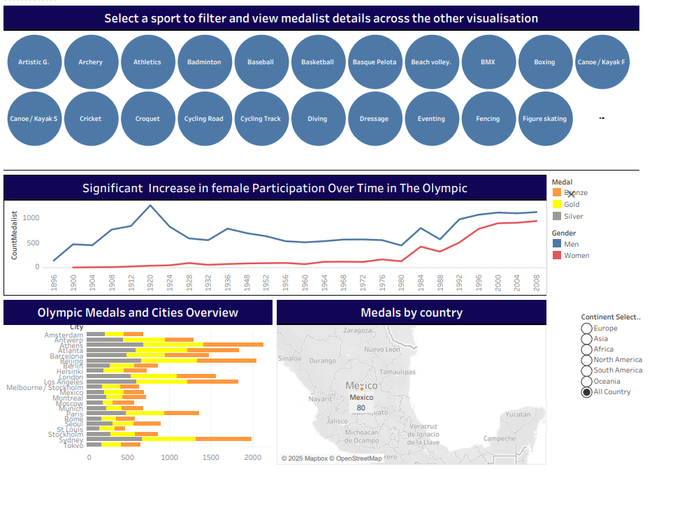

##Summer Olympic Dashboard – Stage 1 (Initial Exploration)

### Overview
This stage represents the **initial exploratory version** of the Summer Olympic dashboard.
The main goal of this phase was to understand the dataset structure, identify key metrics,
and build the first complete analytical view of Olympic history.

The dashboard provides an overview of Olympic medals, host cities, sport categories,
and athlete participation trends over time.

### Focus Areas in Stage 1
- Overall medal distribution (Gold, Silver, Bronze)
- Olympic host cities and medal overview
- Participation trends across years
- Basic sport category analysis

### Dashboard Preview

### Tableau Public
🔗 **Interactive dashboard link:**  
https://public.tableau.com/views/OlympicSummer_17367194596740/SummerOlympic

## Files in this Folder
- 📊 **Tableau Workbook:** `Olympic Summer.twbx`
- 🖼️ **Dashboard Image:** `OlympicSummer1.png`
- 📄 **PDF Version:** `SummerOlympic1.pdf`

### Data Source
- Olympic historical data  
- Public datasets and open Olympic records

### Author
Created by **Mahnoosh Shoaibi**  
Date: January 2025
