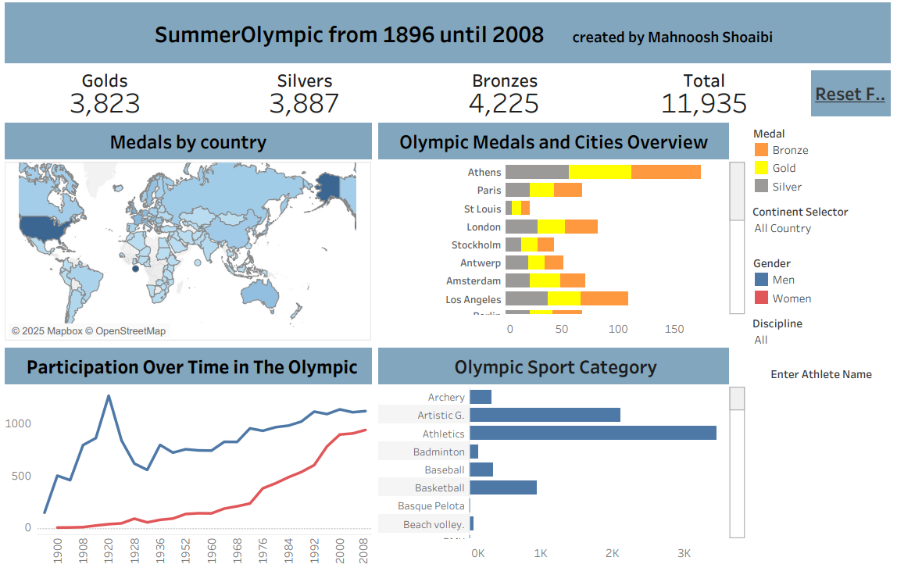

## Summer Olympic Dashboard – Stage 2 (Review & Refinement)

## Overview
This stage represents the **second development phase** of the Summer Olympic dashboard.
Compared to Stage 1, this version focuses on **reviewing the initial design**, improving
visual clarity, and strengthening the analytical storytelling.

The dashboard highlights Olympic medal distribution, host cities, sport categories,
and participation trends over time, with a stronger emphasis on **female participation**.

### Key Improvements in Stage 2
- Improved layout and visual hierarchy
- Clearer comparison of male vs. female participation trends
- Enhanced usability of filters (sport, country, gender)
- Refined charts for better readability and interpretation

## Dashboard Preview

## Tableau Public
🔗 **Interactive dashboard link:**  
https://public.tableau.com/views/OlympicSummer_17378525659350/SummerOlympicReview

## Files in this Folder
- 📊 **Tableau Workbook:** `Olympic Summer.twbx`
- 🖼️ **Dashboard Image:** `OlympicSummer2.png`
- 📄 **PDF Version:** `OlympicSummer2.pdf`

## Data Source
- Olympic historical data  
- Public datasets (Kaggle & open Olympic records)

## Author
Created by **Mahnoosh Shoaibi**  
Date: January 2025

