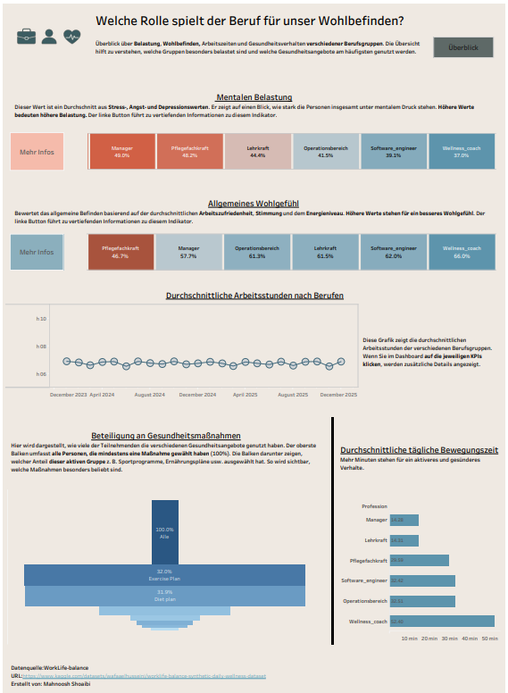

# Work-Life Wellbeing Dashboard

This Tableau dashboard analyzes the relationship between profession and wellbeing,
including mental load, working hours, physical activity, and participation
in health initiatives.

**Target audience:** HR professionals, managers, and health consultants  
**Tool:** Tableau Desktop
## 🔗 Tableau Public
View the interactive dashboard here:  
https://public.tableau.com/views/WorkLife/Main_Dashboard?:language=en-US&publish=yes
---

## 📂 Data Source
- **Dataset:** WorkLife-balance – Synthetic Daily Wellness Dataset  
- **Source:** Kaggle  
- **URL:** https://www.kaggle.com/datasets/wafaaelhusseini/worklife-balance-synthetic-daily-wellness-dataset  

---

## ✍️ Author
**Mahnoosh Shoaibi**

---

## 📅 Date
Nov 2025

